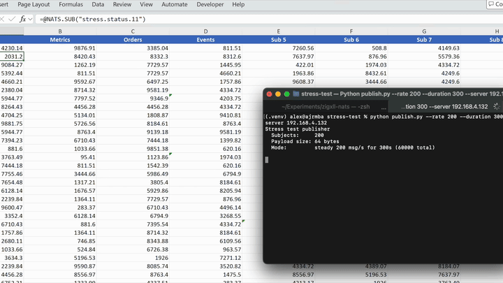
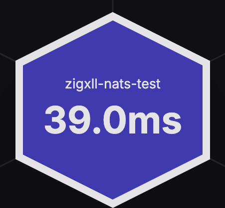

# zigxll-connectors-nats

A NATS connector for Excel built with [ZigXLL](https://github.com/AlexJReid/zigxll). Subscribes to NATS subjects and streams published messages into Excel cells via RTD.

[Introductory blog post](https://alexjreid.dev/posts/zigxll/)

[](https://youtu.be/iCftl9E8PK0)

[Watch the full demo on YouTube](https://youtu.be/iCftl9E8PK0)

## Features

- **Single small binary** (~480KB `.xll` file), no dependencies or setup. Just open it in Excel, or install. (TLS variant requires [Win64 OpenSSL v3](https://slproweb.com/products/Win32OpenSSL.html).)
- **Built on [nats.c](https://github.com/nats-io/nats.c)**, the official, battle-tested NATS C client. Supports TLS, NKey, token, and credentials file authentication out of the box.
- **No .NET, no COM boilerplate, automatic registration.** The RTD server registers itself to `HKCU` on load, no admin rights needed.
- **Custom Excel functions** like `=NATS.SUB("prices.gbp")` so users never need to think about raw `=RTD(...)` syntax.
- **Configurable server addresses.** Single URL or cluster failover via `config.json`.
- **Type hints and JSON extraction.** `=NATS.SUB("ticker.AAPL", "$.price")` parses JSON payloads and returns native Excel types — numbers, bools, strings — ready for formulas and charts.
- **Designed for throughput.** Arena-allocated refresh cycles, zero per-message allocations on the render path, and lock-free handoff from the nats.c thread pool to Excel's RTD polling.

## Usage in Excel

```
=NATS.SUB("my.subject")
```

Or the raw RTD call:

```
=RTD("zigxll.connectors.nats", , "my.subject")
```

Requires a running NATS server. By default connects to `127.0.0.1:4222` — see [Configuration](#configuration) to change this.

### RTD throttle interval

Excel throttles RTD updates via `Application.RTD.ThrottleInterval`, which defaults to 2000ms. For higher update rates, lower it in the VBA Immediate Window (`Alt+F11`, then `Ctrl+G`):

```vb
Application.RTD.ThrottleInterval = 100
```

Set to `0` for the fastest possible updates. This setting persists across sessions.

## Configuration

Connection settings are loaded from a `config.json` file. The search order is:

1. Same directory as the `.xll` file
2. `%APPDATA%\zigxll-nats\config.json`

If no file is found, defaults are used (`nats://127.0.0.1:4222`, no auth, no TLS). All fields are optional.

```json
{
  "url": "nats://myserver:4222",
  "name": "excel-nats"
}
```

### NGS / Synadia Cloud

To connect to [NGS](https://synadia.com/ngs) or any Synadia Cloud deployment, use the TLS variant of the XLL and a `.creds` file exported from your account:

```json
{
  "url": "tls://connect.ngs.global",
  "name": "zigxll-nats",
  "credentials_file": "C:\\Users\\you\\Desktop\\ngs.creds"
}
```

This also applies to any self-hosted NATS deployment using operator/account JWTs with credentials files.



### All options

| Field | Type | Description |
|-------|------|-------------|
| `url` | string | Server URL. Default `nats://127.0.0.1:4222` |
| `servers` | string[] | Multiple server URLs for cluster failover (overrides `url`) |
| `name` | string | Connection name (visible in NATS monitoring) |
| `user` | string | Username for user/password auth |
| `password` | string | Password for user/password auth |
| `token` | string | Auth token |
| `credentials_file` | string | Path to `.creds` file (JWT + NKey, for NATS NGS / operator mode) |
| `nkey_public` | string | NKey public key (the `N...` string) |
| `nkey_seed_file` | string | Path to NKey seed file (requires `nkey_public`) |
| `tls` | bool | Enable TLS (requires [OpenSSL for Windows](https://slproweb.com/products/Win32OpenSSL.html)). Default `false` |
| `tls_ca_cert` | string | Path to CA certificate file |
| `tls_cert` | string | Path to client certificate file |
| `tls_key` | string | Path to client private key file |
| `tls_skip_verify` | bool | Skip server cert verification (dev only). Default `false` |
| `connect_timeout_ms` | int | Connection timeout in milliseconds |
| `ping_interval_ms` | int | Ping interval in milliseconds |
| `max_reconnect` | int | Max reconnect attempts (`-1` for unlimited) |
| `reconnect_wait_ms` | int | Wait between reconnect attempts in milliseconds |

## Building

### Cross-compilation setup

Although Excel XLL assemblies only run on Windows, ZigXLL cross-compiles Windows XLL add-ins from macOS or Linux with the help of [xwin](https://jake-shadle.github.io/xwin/).

**Windows:** Skip this section.

**macOS:**
```bash
brew install xwin
xwin --accept-license splat --output ~/.xwin
```

**Linux:**
```bash
cargo install xwin
xwin --accept-license splat --output ~/.xwin
```

If Cargo isn't available, install Rust via [rustup.rs](https://rustup.rs/) or download a prebuilt binary from the [xwin releases page](https://github.com/Jake-Shadle/xwin/releases).

See the [ZigXLL README](https://github.com/AlexJReid/zigxll) for more details.

**Note:** Cross-compilation does not yet support TLS (`-Dtls=true`), as it requires OpenSSL `.lib` files for the target platform to be available locally. CI builds natively on Windows with TLS enabled.

### Build the XLL

```bash
zig build
```

The XLL will be output to `zig-out/lib/zigxll-connectors-nats.xll`.

## RTD Servers

| ProgID | CLSID | Description |
|--------|-------|-------------|
| `zigxll.connectors.nats` | `{F3910D1B-338F-49D4-A364-B113EA6CE115}` | Subscribe to NATS subjects |

RTD servers are registered automatically when the XLL is loaded into Excel (writes to `HKCU\Software\Classes`, no admin needed).

## Excel Functions

| Function | Description |
|----------|-------------|
| `=NATS.SUB("subject")` | Subscribe to a NATS subject (RTD wrapper) |
| `=NATS.SUB("subject", "type")` | Subscribe with a type hint (see below) |

### Type hints

The optional second argument to `NATS.SUB` controls how the received payload is interpreted:

| Usage | Behavior |
|---|---|
| `=NATS.SUB("prices.BTC")` | Auto: duck-types — tries bool, int, float, falls back to string |
| `=NATS.SUB("prices.BTC", "number")` | Forces numeric coercion, `#VALUE!` if not parseable |
| `=NATS.SUB("flags.active", "bool")` | Forces bool (`"true"`/`"false"`), `#VALUE!` otherwise |
| `=NATS.SUB("data.raw", "string")` | Always string, no coercion |
| `=NATS.SUB("ticker.AAPL", "$.price")` | Parses JSON payload, extracts `price` field, type from JSON |
| `=NATS.SUB("ticker.AAPL", "$.quote.last")` | Nested dot-path: `{"quote":{"last":142.5}}` → `142.5` as double |

When omitted, the default is `auto` — values that look like numbers or booleans are returned as native Excel types, enabling direct use in formulas and charts without manual conversion.

## Architecture

The XLL embeds a vendored copy of [nats.c](https://github.com/nats-io/nats.c), compiled as a static library. This required some patches to work in the Zig XLL build environment (bypassing `InitOnceExecuteOnce` and `atexit` which deadlock without a full MSVC CRT). It may be possible to use nats.c as a Zig build system dependency instead of vendoring, but this hasn't been explored yet. Messages arrive on nats.c's internal thread pool via a subscription callback, which stores the latest value per topic and notifies Excel to refresh.

Key implementation details:

- **Arena allocator** for UTF-16 string conversions during Excel refresh cycles -reset once per `RefreshData` batch, zero malloc/free churn on the hot path
- **Null-terminated subject copies** when passing Zig slices to the nats.c C API
- **CRT compatibility patches** for the Zig XLL build environment -`InitOnceExecuteOnce` and `atexit()` are bypassed as they can deadlock in DLLs built with Zig's CRT stubs

## Download

Pre-built, signed XLLs for 64-bit Excel on Windows:

| Variant | Download | Notes |
|---------|----------|-------|
| **Standard** | [zigxll-connectors-nats-notls.xll](https://github.com/AlexJReid/zigxll-connectors-nats/releases/latest/download/zigxll-connectors-nats-notls.xll) | No external dependencies |
| **With TLS** | [zigxll-connectors-nats.xll](https://github.com/AlexJReid/zigxll-connectors-nats/releases/latest/download/zigxll-connectors-nats.xll) | Requires [Win64 OpenSSL v3](https://slproweb.com/products/Win32OpenSSL.html) (64-bit) |

1. Download one of the XLLs above
2. You may need to unblock it: [Excel is blocking untrusted XLL add-ins](https://support.microsoft.com/en-gb/topic/excel-is-blocking-untrusted-xll-add-ins-by-default-1e3752e2-1177-4444-a807-7b700266a6fb)
3. Double-click the `.xll` file to load it into Excel

## Roadmap

- **JetStream:** subscribe to JetStream consumers for durable, replay-capable streams with at-least-once delivery
- **Last value population:** populate cells with the most recent value on subscribe, so sheets aren't empty until the next publish
- **Debouncing/windowing:** reduce unnecessary recalculations, e.g. round to 3 decimal places and only update the cell if the rounded value differs
- **Publish support:** `=NATS.PUB("subject", value)` to publish messages back to NATS from Excel
- **Reconnect status in cells:** surface connection state (connected/reconnecting/disconnected) so users can see when the link is down

## License

MIT. See [LICENSE](LICENSE) for details.

This project uses [nats.c](https://github.com/nats-io/nats.c) (Apache 2.0) and [ZigXLL](https://github.com/AlexJReid/zigxll) (MIT). See [NOTICE](NOTICE) for attribution.


